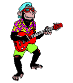

    

    

  
<b>Currently Jammin! to:</b>

  

    
    
    
  

    
<b>Write something nice in my guest book:</b>

    

  
  <b>You are visitor no.</b>
  
  

<marquee>
    
    
    
</marquee>